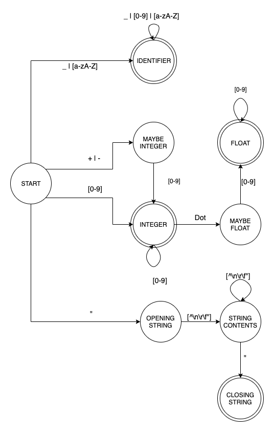

# A5 Programming Language Lexer

### Team
Gregory A. Sandoval

## Introduction 
The objective of this assignment is to write a lexer for the A5 language
lexicon: its tokens (i.e., legal ``words''). The lexer transforms an A5
high-level program sequence of characters into a list of tokens for that
program (in a special format). For convenience, this lexer will take
input from standard-input (stdin) and send output to standard-output
(stdout).

A lexer is a deterministic finite automata. This is generally hidden
behind layers of character manipulation and large switch statements. 
Instead, I wanted to focus on the DFA itself, and let the low level 
details fade in background. This led to modeling the graph, then modeling
a lexer, which uses the graph. The core of the code revolved around the 
idea that a lexer shouldn't have to know about the language it's lexing, it should 
just take in the graph that represents the language, and the tokens to 
produce, and it should just work. Furthermore, the tokens that are parsed 
should be distinguishable, with little to no 'special cases'. This involved a
heavy use of polymorphism and generics. This allows you to quickly find type
information using the instanceof operator, rather than carrying around a type
field that you use to determine what type the value is, which is not ideal. 
Although the code hasn't reached the full goal, it's enough to 
complete this assignment. 
 
## The Graph
To model the DFA, I needed a way to model a graph. Rather than taking the 
traditional approach of an adjacency list, I opted for just nodes. There is
no 'Graph' class, rather a node holds a reference to a list of
other nodes, making edges. Each of these 'edges' has a corresponding
predicate function, which takes some parameter and returns whether we
should `walk' to the other node. Walking the graph can be done by
repeatedly finding the next node to walk to giving a particular object.

## The Lexer
Given the graph abstraction, we can create a deterministic finite
automata using a graph. Each graph node represents a state in the DFA;
Each graph edge has a predicate function that determines if a letter
would cause a transition. The lexer _extends_ graph
nodes, adding relevant information, i.e, if the current state is a
*final* or *non-final* state. Accepting tokens would be
modeled by iteratively passing a character to the lexer, which defers to
the graph, until no viable transition can be made, accepting the token
on a final state.

The code comes with several built-in predicates for detection of
letters, numbers, white space, etc. I could've used a regular expression for
detecting character classes, but that's cheating! 
You wouldn't write a hash table using a hash table right? :)

### Example Code
Although the code for parsing is somewhat readable, it's a far cry from 
perfect. From a high level perspective, I wanted the code to read like the
grammar itself. Unfortunately, we must define states before they're used,
which makes the code not so declarative, but the alternative was using pure
strings, which cannot be checked at compile time, risking runtime errors.
So, apologies for the sheer number of classes! I considered them a hard
requirement, as it allows the comparison of token types directly, as opposed
to deferring to some internal variable of the token class, and writing
several special cases.

```java
import compiler.lexer.FinalState;
import compiler.lexer.LexerBuilder;
import compiler.lexer.NonFinalState;
import compiler.lexer.token.IntegerToken;
import compiler.lexer.token.WhitespaceToken;

import static compiler.a5.lexicon.A5EdgePredicates.*;

class MyHeavyHitterClass {
  // Lexer for integers, skipping white spaces
  public static void main(String[] args) {
    // States
    var START = new NonFinalState("START");
    var INTEGER = new FinalState("INTEGER", IntegerToken::new);
    var WHITESPACE = new FinalState("WHITESPACE", WhitespaceToken::new);

    // Transitions
    START.ON(A_WHITESPACE).OR(A_LINE_SEPARATOR).GOTO(WHITESPACE);
    WHITESPACE.ON(A_WHITESPACE).OR(A_NEWLINE).GOTO(WHITESPACE);
    START.ON(A_DIGIT).GOTO(INTEGER);
    INTEGER.ON(A_DIGIT).GOTO(INTEGER);

    var lexer = new LexerBuilder().setStartState(START).createLexer();

    // Convert text to tokens, filter out whitespace, accept only integers
    lexer.analyze("123 43 23 34")
      .stream()
      .filter(token -> !(token instanceof WhitespaceToken))
      .forEach(System.out::println);
  }
}
```

## A5 Grammar
The grammar for the A5 programming language is defined using the normal
regular expression syntax found in most programming languages. The numbers 
next to production rule is the token ID. The token ID is part of the produced 
output.

The grammar corresponds to the DFA depicted in Figure 1, like in most texts,
consider any missing transitions to exist and lead to a shared error
state. The diagram doesn't include non-terminals, since it would be far
too large to display! Please excuse the use of a regular expression for
edges, including every edge would be a horrible mess.

```
01. comment = '//' .*  
02. id = LU LUD *  
    LU = '_' | [a-zA-Z]  
    LUD = LU | [0-9]  
03. int = SIGN ? DIGITS 
04. float = int [ '.' DIGITS ] ? 
05. string = '"' .* '"' 
    SIGN = plus | minus
    DIGITS = [0-9] +
  
// Unpaired delimiters
06. comma = ','
07. semi = ';'
 
// Keywords
10. kprog = "prog"
11. kmain = "main"
12. kfcn = "fcn"
13. kclass = "class"
15. kfloat = "float"
16. kint = "int"
17. kstring = "string"
18. kif = "if"
19. kelseif = "elseif"
20. kelse = "else"
21. kwhile = "while"
22. kinput = "input"
23. kprint = "print"
24. knew = "new"
25. kreturn = "return"
26. kvar = "var"

// Paired delimeters
31. angle1 = '<'
32. angle2 = '>'
33. brace1 = '{'
34. brace2 = '}'
35. bracket1 = '['
36. bracket2 = ']'
37. parens1 = '('
38. parens2 = ')'

// Other punctuation tokens
41. aster = '*'
42. caret = '^'
43. colon = ':'
44. dot = '.'
45. equal = '='
46. minus = '-'
47. plus = '+'
48. slash = '/'
49. ampersand = '&'

// Multi-char operators
51. oparrow = "->"
52. opeq = "=="
53. opne = "!="
54. ople = "<="
55. opge = ">="
56. opshl = "<<"
57. opshr = ">>"

// Miscellaeous
99. error // Unknown token.
00. eof // End-of-Input.\
 ```



## Dependencies
```shell script
brew install java
brew install ant
```


## How to run
In the root directory, run the following commands. The first command
builds the java code. The second passes a text file to the lexer. The
lexer outputs the results to standard out, in `.alex` format.

```
ant
java -cp ./out/production/Lexer compiler.Main < TestInput.txt
```

I've included a sample test file, the expected result after running the
java code should be as follows.

```
(Tok: 10 lin= 1,1 str = "prog")
(Tok: 11 lin= 1,6 str = "main")
(Tok: 33 lin= 1,11 str = "{")
(Tok: 23 lin= 2,5 str = "print")
(Tok: 37 lin= 2,10 str = "(")
(Tok: 5 lin= 2,12 str = "Input legs> ")
(Tok: 38 lin= 2,27 str = ")")
(Tok: 7 lin= 2,28 str = ";")
(Tok: 2 lin= 3,5 str = "var")
(Tok: 2 lin= 3,9 str = "a")
(Tok: 45 lin= 3,11 str = "=")
(Tok: 22 lin= 3,13 str = "input")
(Tok: 37 lin= 3,18 str = "(")
(Tok: 16 lin= 3,20 str = "int")
(Tok: 38 lin= 3,24 str = ")")
(Tok: 7 lin= 3,25 str = ";")
(Tok: 2 lin= 4,5 str = "var")
(Tok: 2 lin= 4,9 str = "b")
(Tok: 45 lin= 4,11 str = "=")
(Tok: 22 lin= 4,13 str = "input")
(Tok: 37 lin= 4,18 str = "(")
(Tok: 16 lin= 4,20 str = "int")
(Tok: 38 lin= 4,24 str = ")")
(Tok: 7 lin= 4,25 str = ";")
(Tok: 23 lin= 5,5 str = "print")
(Tok: 37 lin= 5,10 str = "(")
(Tok: 5 lin= 5,12 str = "Hypotenuse= ")
(Tok: 6 lin= 5,26 str = ",")
(Tok: 37 lin= 5,28 str = "(")
(Tok: 2 lin= 5,30 str = "a")
(Tok: 41 lin= 5,32 str = "*")
(Tok: 2 lin= 5,34 str = "a")
(Tok: 47 lin= 5,36 str = "+")
(Tok: 2 lin= 5,38 str = "b")
(Tok: 41 lin= 5,40 str = "*")
(Tok: 2 lin= 5,42 str = "b")
(Tok: 38 lin= 5,44 str = ")")
(Tok: 42 lin= 5,46 str = "^")
(Tok: 4 lin= 5,48 str = "0.5" flo= 0.5)
(Tok: 38 lin= 5,52 str = ")")
(Tok: 7 lin= 5,53 str = ";")
(Tok: 34 lin= 6,1 str = "}")
(Tok: 0 lin= 6,2 str = "")
```

To print every transition performed in the DFA, pass the cli option of `-verbose`,
like so

```
java -cp ./out/production/Lexer compiler.Main -verbose < TestInput.txt 
```

The command outputs some informative transitions, helps with debugging grammar :)

```
START           = 'p' => IDENTIFIER     
IDENTIFIER      = 'r' => IDENTIFIER     
IDENTIFIER      = 'o' => IDENTIFIER     
IDENTIFIER      = 'g' => IDENTIFIER     
Accepted token value: "prog"

START           = ' ' => WHITESPACE     
Accepted token value: " "

START           = 'm' => IDENTIFIER     
IDENTIFIER      = 'a' => IDENTIFIER     
IDENTIFIER      = 'i' => IDENTIFIER     
IDENTIFIER      = 'n' => IDENTIFIER     
Accepted token value: "main"

START           = ' ' => WHITESPACE     
Accepted token value: " "

START           = '{' => LEFT_BRACE     
Accepted token value: "{"

[ The rest has been removed ]
```


## Features
- Ability to log every transition in the DFA.
- Tracks line number and position.
- On error, logs problem line with bad character highlighted
- Extendable, should work with any regular language.
- Declarative, just build the states, and add the corresponding tokens, done!
- Easy to debug DFA, turn on the transition logger and just worry about transitions!
- Hides all character manipulations from the client.
